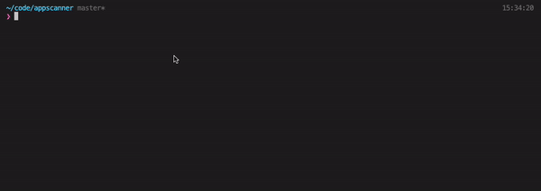

# App Scanner CLI

Find out what the mobile application was developed with.

- [App Scanner CLI](#app-scanner-cli)
  - [How it works (steps)](#how-it-works-steps)
  - [🚀 Roadmap](#-roadmap)
    - [🔨 Frameworks compatibilities](#-frameworks-compatibilities)
    - [🔍 Scan features](#-scan-features)
  - [👨🏼‍💻 Installation](#-installation)
    - [Auto install](#auto-install)
    - [Manual install](#manual-install)
  - [Preview](#preview)
  - [🏄🏼‍♂️ Run](#️-run)
    - [CLI Arguments](#cli-arguments)
  - [🕵🏼 How to detect Frameworks](#-how-to-detect-frameworks)
    - [1. By detecting typical architecture files (100% reliable)](#1-by-detecting-typical-architecture-files-100-reliable)
    - [2. With grep match (50% reliable - not suggested)](#2-with-grep-match-50-reliable---not-suggested)

## How it works (steps)

- Step 1 - Download APK
- Step 2 - Decode APK
- Step 3 - Scan decoded APK

## 🚀 Roadmap

### 🔨 Frameworks compatibilities

> Try to update frameworks following [State of JS Mobile](https://2020.stateofjs.com/en-US/technologies/mobile-desktop/)

- [x] [React Native](https://reactnative.dev/)
- [x] [Flutter](https://flutter.dev/)
- [x] [Xamarin](https://dotnet.microsoft.com/apps/xamarin)
- [x] [Cordova](https://cordova.apache.org/)
- [x] [Capacitor](https://capacitorjs.com/)
- [x] [Ionic](https://ionicframework.com/)

### 🔍 Scan features

- [x] Android APK scan
- [ ] iOS App scan
- [x] Bulk Scan
- [ ] Build an intuitive web app
- [ ] Scan vulnerabilities
  - [x] Scan sensitive data
  - [ ] Scan security fails

## 👨🏼‍💻 Installation

### Auto install

If you're on MacOS you can run this command `yarn run install:macos`

### Manual install

1. Install firstly [gplaydl](https://github.com/rehmatworks/gplaydl) and login with your Play Store account
2. Install [Apktool](https://ibotpeaches.github.io/Apktool/documentation/)
3. Install node_modules with `yarn`

## Preview

## 🏄🏼‍♂️ Run

`yarn start`

or you can start with [following arguments](#cli-arguments):

`yarn start --apkID com.facebook.katana`

`yarn start --scanListFile ./myAPKsList.txt`

### CLI Arguments

| parameters | description | required | default value |
|-|-|-|-|
| apkID | Android APK Play Store ID | false |  |
| scanListFile | File containing a list of APK IDs | false |  |

## 🕵🏼 How to detect Frameworks

### 1. By detecting typical architecture files (100% reliable)

Example a **React Native** Android decompiled app always contains an `assets/index.android.bundle` file.

We've indentified typical framework architectures. [Take a look here](./src/config/frameworks.ts) for more details. Open to new frameworks suggestions.

### 2. With grep match (50% reliable - not suggested)

Check an example on a command that we run to check **react native** occurances in app files.

`grep -iR "react_native\|react-native\|reactnative" ${apkDecodedPath} | wc -w`
